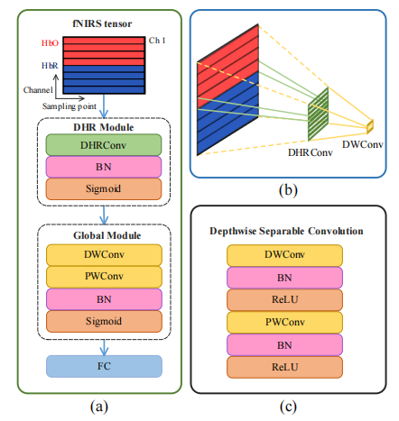

# fNIRSNet
## Rethinking Delayed Hemodynamic Responses for fNIRS Classification
This paper was accepted for publication in IEEE Transactions on Neural Systems and Rehabilitation Engineering (https://ieeexplore.ieee.org/document/10311392/).


##  1.  Abstract

Currently, deep neural networks do not consider the inherent delayed hemodynamic responses of fNIRS signals, which causes many optimization and application problems. Considering the kernel size and receptive field of convolutions, delayed hemodynamic responses as domain knowledge are introduced into fNIRS classification, and a concise and efficient model named fNIRSNet is proposed. We empirically summarize three design guidelines for fNIRSNet. fNIRSNet is friendly to practical applications and reduces the hardware cost of BCI systems.

<div align='center'>

</div>


## 2. Datasets

### 2.1.  MA
Paper: [1]

Dataset:  http://doc.ml.tu-berlin.de/hBCI 

Github:  https://github.com/JaeyoungShin/hybrid-BCI 

### 2.2.  UFFT
Paper: [2]

Dataset: https://doi.org/10.6084/m9.figshare.9783755.v1 

Github: https://github.com/JaeyoungShin/fNIRS-dataset 


## 3. Baseline Models
### 3.1.  fNIRS-T
Paper: [3]

Github:  https://github.com/wzhlearning/fNIRS-Transformer

### 3.2.  1D-CNN
Paper: [4]

Github:  https://github.com/sunzhe839/tensorfusion_EEG_NIRS

### 3.3.  CNN and LSTM
Paper: [5]

Github:  https://github.com/boyanglyu/nback_align


## 4. Code

 ***scripts***:  The  directory contains conversion code for the MA and UFFT datasets. 

***KFold_Train.py*** :  Train  fNIRSNet using KFold-CV .

***KFold_Result.py*** :  Evaluate the experimental results of KFold-CV .

***LOSO_Train.py*** :  Train  fNIRSNet using LOSO-CV .

***LOSO_Result.py*** :  Evaluate the experimental results of LOSO-CV.

***fNIRSNet.py*** :  Code for the proposed fNIRSNet.

***dataloader.py*** :  Load  the MA and UFFT datasets.

***LabelSmoothing.py*** : Label smoothing.

4.1 Extract datasets using the mat files from the ***scripts*** folder. You will need to download the BBCI library from the dataset link. 

4.2 Run ***KFold_Train.py*** to perform KFold-CV training. Run ***KFold_Result.py*** to obtain results.

4.3 Run ***LOSO_Train.py*** to execute LOSO-CV training. Run ***LOSO_Result.py*** to obtain results.

You need to specify the dataset and dataset path before training or test.

```
# Select dataset through task_id
task = ['UFFT', 'MA']
task_id = 0

# Set dataset path
UFFT_data_path = ''
MA_data_path = ''
```


## 5. Citation

If you found the study useful for you, please consider citing it:

```
@ARTICLE{wang2023fNIRSNet,
author  = {Wang, Zenghui and Fang, Jihong and Zhang, Jun},
journal = {IEEE Transactions on Neural Systems and Rehabilitation Engineering}, 
title   = {Rethinking Delayed Hemodynamic Responses for fNIRS Classification}, 
year    = {2023},
volume  = {31},
number  = {},
pages   = {4528-4538},
doi     = {10.1109/TNSRE.2023.3330911}}
```


Our other work:
https://ieeexplore.ieee.org/document/9670659
```
@ARTICLE{Wang2022Transformer,  
author  = {Wang, Zenghui and Zhang, Jun and Zhang, Xiaochu and Chen, Peng and Wang, Bing},  
journal = {IEEE Journal of Biomedical and Health Informatics},   
title   = {Transformer Model for Functional Near-Infrared Spectroscopy Classification},   
year    = {2022},  
volume  = {26},  
number  = {6},  
pages   = {2559-2569},  
doi     = {10.1109/JBHI.2022.3140531}}
```


https://ieeexplore.ieee.org/abstract/document/9828508
```
@ARTICLE{Wang2022VisionfNIRSFramework,
author  = {Wang, Zenghui and Zhang, Jun and Xia, Yi and Chen, Peng and Wang, Bing},
journal = {IEEE Transactions on Neural Systems and Rehabilitation Engineering}, 
title   = {A General and Scalable Vision Framework for Functional Near-Infrared Spectroscopy Classification}, 
year    = {2022},
volume  = {30},
number  = {},
pages   = {1982-1991},
doi     = {10.1109/TNSRE.2022.3190431}}
```


## References

[1] J. Shin, A. von Luhmann, B. Blankertz, D.-W. Kim, J. Jeong, H.-J. Hwang, and K.-R. Muller, “Open access dataset for EEG+NIRS single-trial classifification,” *IEEE Trans. Neural Syst. Rehabil. Eng.*, vol. 25, no. 10, pp. 1735–1745, 2017.

[2] S. Bak, J. Park, J. Shin, and J. Jeong, “Open-access fNIRS dataset for classifification of unilateral finger-and foot-tapping,” *Electronics*, vol. 8, no. 12, p. 1486, 2019.

[3] Z. Wang, J. Zhang, X. Zhang, P. Chen, and B. Wang, “Transformer model for functional near-infrared spectroscopy classification,” *IEEE J. Biomed. Health Inform.*, vol. 26, no. 6, pp. 2559–2569, 2022.

[4] Z. Sun, Z. Huang, F. Duan, and Y. Liu, “A novel multimodal approach for hybrid brain–computer interface,” *IEEE Access*, vol. 8, pp. 89 909–89 918, 2020.

[5] B. Lyu, T. Pham, G. Blaney, Z. Haga, A. Sassaroli, S. Fantini, and S. Aeron, “Domain adaptation for robust workload level alignment between sessions and subjects using fNIRS,” *J. Biomed. Opt.*, vol. 26, no. 2, pp. 1–21, 2021.
